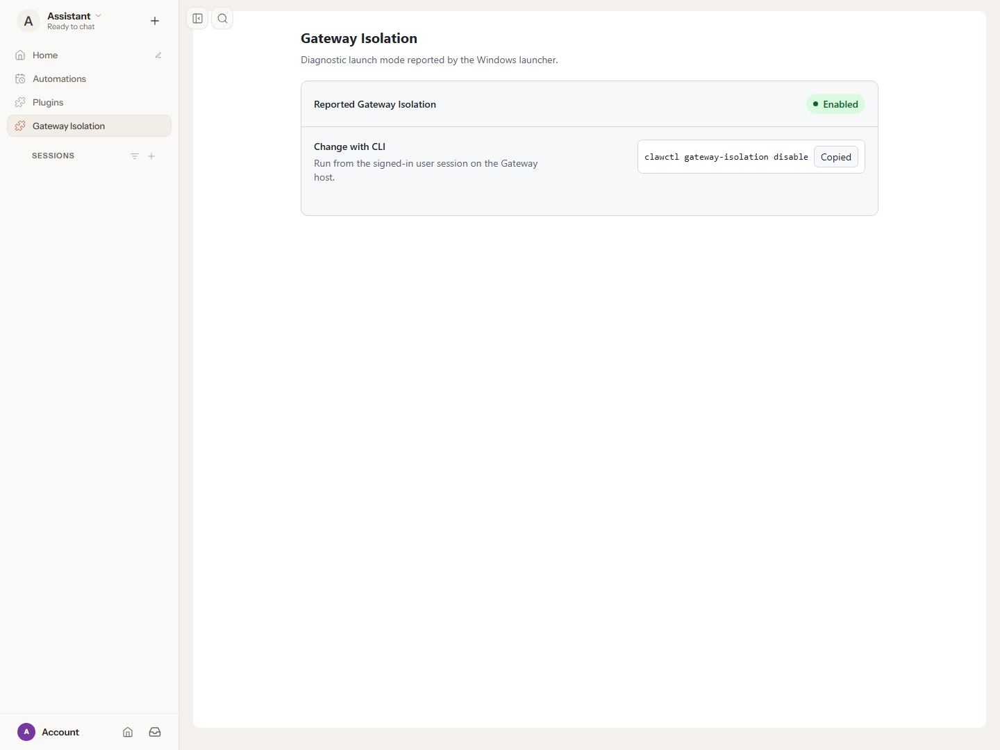
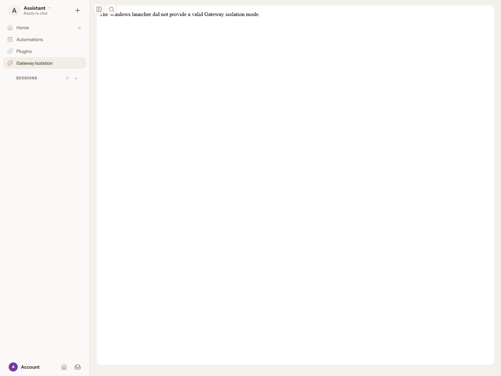

# Gateway Isolation validation

## Why is this change being made?

PR #28 adds launcher-reported Gateway isolation status, a read-only authenticated
Control UI tab, and payload provisioning. This evidence covers those implemented
contracts against production source `9aa1df286c2b6fd59b4c101201ddae0ae6000324`.

## What changed?

Added reusable validation harnesses, expanded regression tests, named test results,
HTTP/browser assertions, runtime registration output, and authentic screenshots.
Launcher and plugin production code are unchanged.

## How was the change tested?

### Evidence matrix

| Implemented contract | Executed check and result | Proof |
|---|---|---|
| Interactive launcher selects `disabled` | Real NativeAOT `openclaw.exe` started the Gateway with inherited `CLAWCTL_GATEWAY_ISOLATION=enabled`. The child Gateway and authenticated Control UI reported **Disabled**, proving the launcher overrides inherited input | [Runtime matrix: launcher-disabled](runtime-matrix.json), [screenshot](launcher-disabled.png) |
| Both exact values are supported | Real Gateway processes with explicit `enabled` and `disabled` launcher-input fixtures rendered the correct state, green/warning tone, and inverse CLI command | [Runtime matrix](runtime-matrix.json), [Enabled](fixture-enabled.png), [Disabled](fixture-disabled.png) |
| Invalid or absent input fails closed | Missing, `invalid`, `ENABLED`, empty, and whitespace-padded input each returned **HTTP 503** and rendered the invalid-launcher-mode diagnostic, with no status badge, CLI command, or Copy control | [Runtime matrix](runtime-matrix.json), [missing](fixture-missing.png), [invalid](fixture-invalid.png), [uppercase](fixture-uppercase.png), [empty](fixture-empty.png), [whitespace](fixture-whitespace.png) |
| Route authentication | Each of eight Gateway runs checked GET and HEAD with no token, a wrong token, and the correct token. Unauthorized requests returned **401**; authorized requests returned **200** or **503** according to input. HEAD had an empty body | [80 HTTP case results](runtime-matrix.json) |
| Read-only route | Authenticated POST, PUT, PATCH, and DELETE returned the same read-only page bytes as GET. A subsequent GET remained identical. This handler serves status for these methods; it does not implement a mutation action | [Runtime matrix](runtime-matrix.json), [command output](runtime-checks.txt) |
| Response hardening | Successful and fail-closed responses had `Cache-Control: no-store`, `X-Content-Type-Options: nosniff`, `Referrer-Policy: no-referrer`, and CSP restricting frame ancestors to self | [Runtime assertions](../../../scripts/validation/gateway-isolation-runtime.mjs) |
| Full authenticated Control UI integration | All eight runs completed normal `hello-ok` handshakes with the matching bundled build, exposed the sidebar tab, and rendered the plugin in `sandbox="allow-scripts"` without `allow-same-origin` | [Runtime matrix](runtime-matrix.json), screenshots below |
| Copy behavior | Clicked Copy for the real launcher and both valid input fixtures. The button reported **Copied**, and browser clipboard readback equaled the exact inverse CLI command | [Runtime matrix](runtime-matrix.json) |
| Clipboard capability branches | Six browser capability fixtures exercised Clipboard API success, API denial with legacy-copy success, and both methods unavailable, for both valid states. Manual fallback kept the exact command selected and showed the manual-copy instruction | [Fixture results](copy-fixtures.json), [output](copy-checks.txt), [harness](../../../scripts/validation/gateway-isolation-copy.mjs) |
| Process-stable reporting | Seven initial inputs were each read exactly once. After plugin construction, repeated changes to the input source did not change any response, including fail-closed responses | [21 passing Node tests](plugin-tests.tap), [test source](../../../plugins/gateway-isolation/index.test.js) |
| Typed launcher selection | Enabled/Disabled mappings and invalid enum rejection passed, alongside argument forwarding, working-directory, process, and entrypoint regressions | [57 named passing .NET results](launcher-tests.json), [test source](../../../tests/OpenClaw.Launcher.Tests/GatewayLauncherTests.cs) |
| Minimal runtime surface | Real launcher-driven runtime inspection reported bundled, enabled, activated, loaded, imported; **one HTTP route**, **zero Gateway methods, tools, services, diagnostics, hooks, commands, discovery services, MCP servers, and LSP servers** | [Sanitized runtime inspection](runtime-registration.json) |
| Control descriptor | Node tests verify the exact label, Control group, order, icon, route, `operator.read` scope, gateway authentication, and exact path matching | [Node results](plugin-tests.tap) |
| Payload acceptance and rejection | **66 passed:** 33 per architecture. Six accepted cases verified exact three-file shipping content, matching hashes, metadata, excluded tests, and environment restoration. Sixty cases rejected missing/conflicting plugin directories, failed runtime inspection, and invalid/missing runtime shapes | [Payload matrix](payload-matrix.json), [transcript](payload-matrix.txt), [reusable harness](../../../scripts/validation/Test-GatewayIsolationPayloadMatrix.ps1) |
| Signing and workflow regressions | Existing signing-input and workflow package-version checks passed | [Command output](policy-checks.txt) |

### Screenshots

**Real NativeAOT launcher, inherited input `enabled`, actual reported state Disabled:**


**Real Gateway with explicit `enabled` launcher-input fixture:**



**Real Gateway with missing launcher-input fixture:**



**Real Gateway with invalid launcher-input fixture:**


The valid-state fixtures set the process input directly while running the real
Gateway, plugin, authentication, and Control UI. The launcher case runs the actual
published executable. All screenshots are captured after clicking Gateway
Isolation through the normal Control UI. The same browser context is reused
across the matrix, including valid-to-invalid transitions.

### Test environment and provenance

Windows x64 build `10.0.26687.0`, .NET SDK `10.0.401`, Node.js `24.16.0`, and
Microsoft Edge `152.0.4191.66` through Playwright. The application uses an expanded
package layout: the NativeAOT launcher beside `app\openclaw.mjs`.

The pinned OpenClaw `2026.8.2` runtime, commit
`0965053fe6b9341776df147a6934b7485c60b5ca`, came from
[workflow run 34546297901](https://github.com/openclaw/openclaw-windows-packaging/actions/runs/34546297901),
artifact `openclaw-gateway-payload-x64` (`10179486438`). That artifact's packaging
commit was `52f2a53fb62b13499ba2692d81870413fcaf943a`. The three PR-owned plugin
files were provisioned into `app\dist\extensions\gateway-isolation`.

The bundled Control UI was built from unmodified source at the same pinned
OpenClaw commit, with its frozen lockfile and declared pnpm `12.1.0`.
The supported build inputs used the Gateway's canonical build timestamp:

```powershell
$env:GIT_COMMIT = '0965053fe6b9341776df147a6934b7485c60b5ca'
$env:OPENCLAW_BUILD_TIMESTAMP = '2026-09-11T00:24:39.157Z'
$env:OPENCLAW_CONTROL_UI_RELEASE_BUILD = '1'
pnpm install --frozen-lockfile --ignore-scripts
pnpm --dir ui build
```

Gateway and UI reported
`2026.8.2-release-0965053fe6b9-2026-09-11T00-24-39.157Z`.
Served JavaScript matched the rebuilt output hash. Authentication and bundled
build-admission checks ran normally. [SHA-256 fingerprints](hashes.json) identify
the exact launcher, Node runtime, plugin, runtime entrypoint, build metadata,
and UI assets. The runtime matrix also records the tested executable hashes.

### Reproduction

From the repository root, with a published launcher/application layout and the
compatible Node executable available:

```powershell
dotnet test .\OpenClaw.Gateway.MSIX.slnx --configuration Release --no-restore
node --test --test-reporter=tap .\plugins\gateway-isolation\index.test.js
node .\scripts\validation\gateway-isolation-runtime.mjs `
  <layout-directory> <node.exe> <evidence-directory>
node .\scripts\validation\gateway-isolation-copy.mjs `
  <layout-directory> <evidence-directory>
pwsh -NoProfile -File .\scripts\validation\Test-GatewayIsolationPayloadMatrix.ps1 `
  -TestRoot .\.validation-payload-matrix `
  -EvidenceDirectory .\docs\validation\pr-28 `
  -ProductionSourceCommit 9aa1df286c2b6fd59b4c101201ddae0ae6000324
.\scripts\Test-SigningInputs.Tests.ps1
.\scripts\Test-WorkflowPackageVersion.Tests.ps1
```

The runtime harness creates isolated profiles and random test credentials, checks
that its loopback port is free before starting, and stops only the process trees
it started. After each case it verifies the port is free. Public results contain
assertions, versions, and hashes rather than tokens or machine-local paths.
