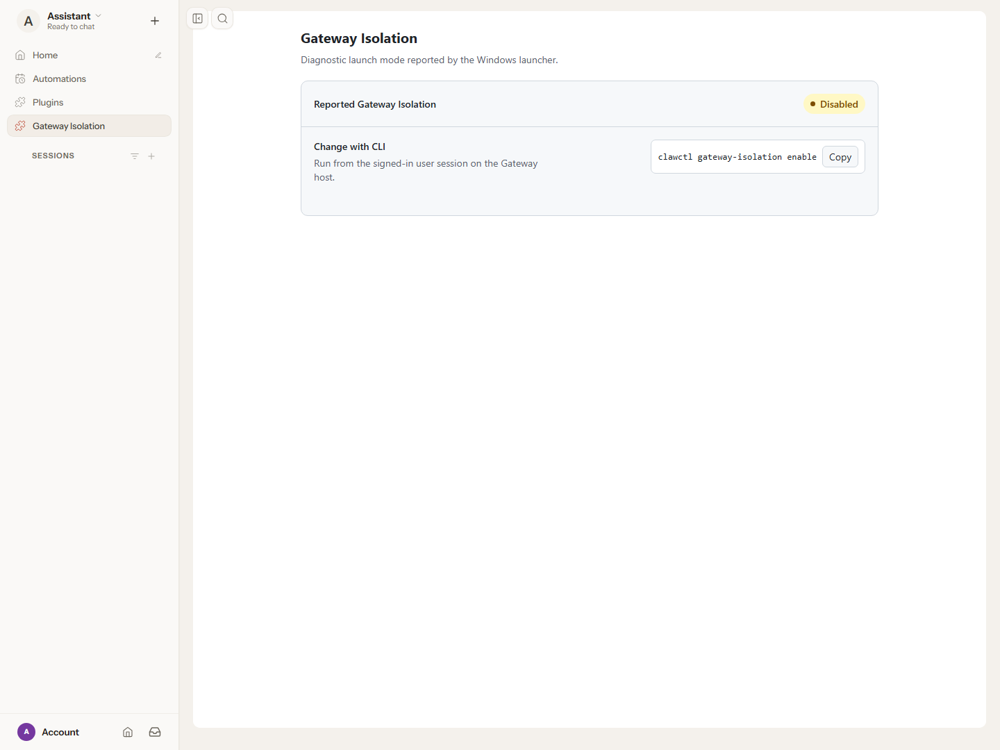

# Gateway Isolation local end-to-end evidence

## Why is this change being made?

PR #28 needs evidence of the real Windows launcher starting a Gateway whose
authenticated Control UI exposes the Gateway Isolation tab. This records the
local run against packaging commit
`9aa1df286c2b6fd59b4c101201ddae0ae6000324`.

## What changed?

No launcher, plugin, or upstream runtime source was changed for this validation.
These files add the full-shell screenshot and sanitized machine-readable results.
The GitHub user-attachments endpoint returned HTTP 404 for the target repository,
so the evidence is stored in the PR branch instead.



## How was the change tested?

The run completed at `2026-09-11T02:45:20.860Z` on Windows x64 build
`10.0.26687.0`, using .NET SDK `10.0.401`, Node.js `24.16.0`, and Microsoft Edge
`152.0.4191.66` through Playwright in headless Chromium mode.

### Runtime composition

The launcher was published as NativeAOT from the exact PR commit. The expanded
x64 application came from the successful
[packaging workflow run 34546297901](https://github.com/openclaw/openclaw-windows-packaging/actions/runs/34546297901),
artifact `openclaw-gateway-payload-x64` (artifact ID `10179486438`).
That workflow's packaging commit was
`52f2a53fb62b13499ba2692d81870413fcaf943a`, not this PR.
Its recorded upstream source is OpenClaw `2026.8.2`,
commit `0965053fe6b9341776df147a6934b7485c60b5ca`.

The PR's three shipping plugin files were copied into
`app\dist\extensions\gateway-isolation`; the plugin test file was not included.
The source and runtime `index.js` SHA-256 values matched.

To resolve the previously reported UI/Gateway build-identity mismatch, the
Control UI was rebuilt from unmodified source at the same upstream commit,
using its frozen dependency lockfile and declared pnpm `12.1.0`. Only the
generated `dist\control-ui` tree was replaced in this validation payload.
The supported build inputs were:

```powershell
$env:GIT_COMMIT = '0965053fe6b9341776df147a6934b7485c60b5ca'
$env:OPENCLAW_BUILD_TIMESTAMP = '2026-09-11T00:24:39.157Z'
$env:OPENCLAW_CONTROL_UI_RELEASE_BUILD = '1'
pnpm install --frozen-lockfile --ignore-scripts
pnpm --dir ui build
```

The timestamp came from the Gateway's canonical `dist\build-info.json`.
The authenticated WebSocket response reported:

```text
type: hello-ok
version: 2026.8.2
buildId: 2026.8.2-release-0965053fe6b9-2026-09-11T00-24-39.157Z
controlUiBuildSource: bundled
```

The JavaScript served by the Gateway matched the rebuilt JavaScript SHA-256.
There was no custom Control UI root, cross-origin UI, edited build metadata,
mock Gateway, injected status HTML, disabled authentication, or build-admission
bypass.

### Launcher-to-browser flow

```powershell
dotnet restore .\OpenClaw.Gateway.MSIX.slnx
dotnet test .\OpenClaw.Gateway.MSIX.slnx --configuration Release --no-restore
dotnet publish .\src\OpenClaw.Launcher\OpenClaw.Launcher.csproj `
  --configuration Release --runtime win-x64 --self-contained
.\scripts\Test-GatewayIsolationPlugin.Tests.ps1
.\scripts\Test-SigningInputs.Tests.ps1
.\scripts\Test-WorkflowPackageVersion.Tests.ps1

# Run the published executable beside the expanded app directory.
# OPENCLAW_STATE_DIR and OPENCLAW_CONFIG_PATH point to a new test-only profile.
# OPENCLAW_GATEWAY_TOKEN contains a newly generated random token, not a real credential.
# CLAWCTL_GATEWAY_ISOLATION is absent from the parent environment.
.\openclaw.exe gateway run --port 19428 --bind loopback --auth token --ws-log compact
```

The profile used local Gateway mode, disabled mDNS and browser automation, and
contained no model credentials. Process inspection confirmed that the listening
`node.exe` process was a child of the published `openclaw.exe`.

| Check | Observed result |
|---|---|
| .NET launcher tests | 54 passed |
| Node plugin tests | 6 passed |
| Synthetic payload provisioning | Passed; this is a fixture test, not the real Gateway |
| Signing-input and workflow-version tests | Passed |
| NativeAOT publish | Passed |
| Actual launcher `--version` | OpenClaw 2026.8.2 (0965053) |
| Real runtime plugin inspection | Bundled, enabled, activated, loaded, imported; one HTTP route; zero Gateway methods, tools, services, or diagnostics |
| Anonymous plugin route request | HTTP 401 |
| Authenticated plugin route request | HTTP 200; `Cache-Control: no-store`; restrictive CSP |
| Full Control UI connection | Token-authenticated `hello-ok`; bundled matching build identity |
| Normal UI navigation | Opened the Control UI, clicked Back to app from the fresh-profile model setup screen, then clicked Gateway Isolation in the sidebar |
| Rendered plugin iframe | `sandbox="allow-scripts"` without `allow-same-origin` |
| Real launcher state | **Disabled**, with `clawctl gateway-isolation enable` guidance |
| Copy affordance | Clicked Copy; button reported **Copied**. Clipboard contents were not independently read back |
| RPC errors during browser run | None observed |

The screenshot was captured from the real rendered page after the sidebar click.
The model setup screen was exited through its normal Back to app button; no model
was configured or queried. See [e2e-results.json](e2e-results.json) for the sanitized
browser assertions and [hashes.json](hashes.json) for exact file hashes.

### Scope and limitations

This validates the local runtime path in an **expanded, unpackaged application
layout**, not an installed MSIX. It does not validate Store installation,
package identity, execution aliases, MSIX read-only enforcement, signing, ARM64
execution, or an unchanged workflow payload. The UI rebuild described above is
part of the tested composition, not a workflow/source fix.

**Disabled is the real interactive-session launcher's report.** Enabled,
missing, and invalid values are covered by unit tests only. No isolated-session
launch or isolation attestation is claimed. The CLI guidance was displayed and
copied, not executed; changing isolation remains outside this PR's scope.

Only the validation-owned Gateway process tree was stopped after capture. The
test port was checked to be free afterward. No existing Gateway service, user
profile, installed package, or system Node installation was changed.
